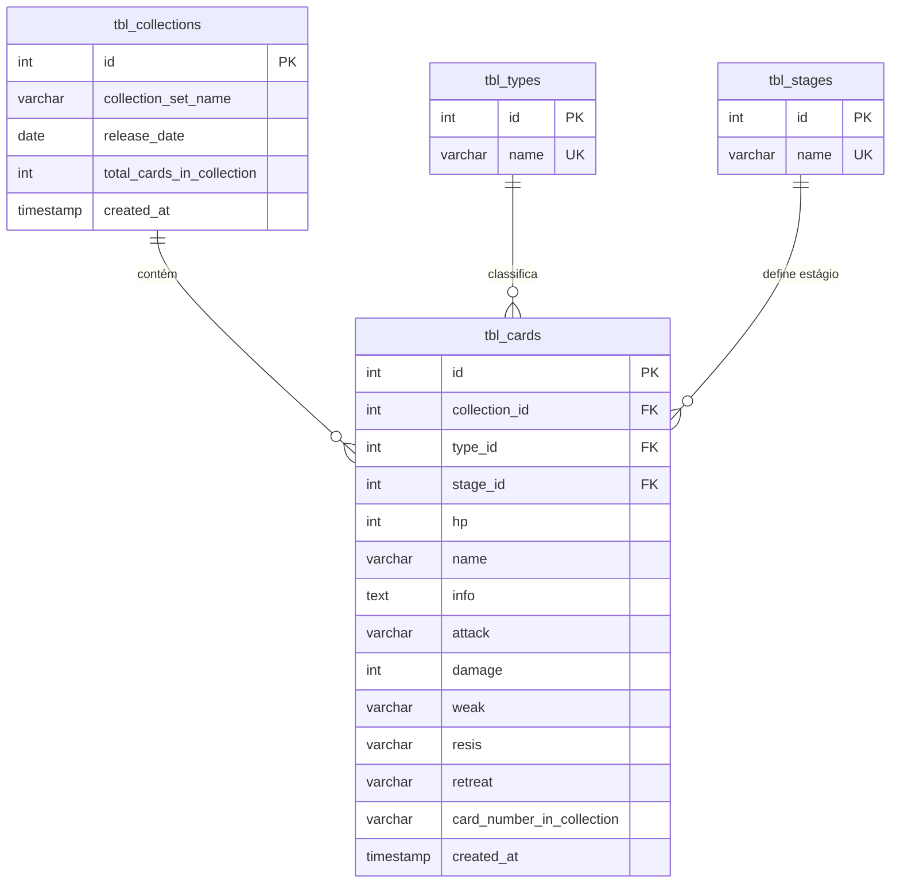

# Pokémon TCG Cards & Collections Database (PostgreSQL)

Este repositório contém os scripts DDL e cargas iniciais (seeds) para modelagem e gerenciamento de cartas de Pokémon TCG e suas coleções em um banco de dados **PostgreSQL**.

---

## 📐 Estrutura do Banco de Dados (3ª Forma Normal - 3NF)

A arquitetura foi projetada garantindo integridade referencial e eliminação de redundâncias:



---

## 📂 Arquivos de Script

- **DDL da Estrutura:** [db_scripts/001_create_card_table.sql](file:///d:/WebApps_Programas_Scripts/dio-bootcamps/bootcamp-bradesco-genai-dados-cyber/desafio03-e-cards/db_scripts/001_create_card_table.sql)
  - Cria as tabelas `tbl_collections`, `tbl_types`, `tbl_stages` e `tbl_cards` com relacionamentos de Chaves Estrangeiras (`FK`).
  - Inclui restrições de integridade e índices para otimização de consultas.
- **Seeds Iniciais:** [db_scripts/seeds/001_seeds_cards.sql](file:///d:/WebApps_Programas_Scripts/dio-bootcamps/bootcamp-bradesco-genai-dados-cyber/desafio03-e-cards/db_scripts/seeds/001_seeds_cards.sql)
  - Carga de dados iniciais para tipos de Pokémon, estágios (Basic, Stage 1, VMAX, etc.), uma coleção modelo e uma carta de exemplo.

---

## 🚀 Como Executar no PostgreSQL

1. **Criar as Tabelas:**
   ```bash
   psql -U seu_usuario -d seu_banco -f db_scripts/001_create_card_table.sql
   ```

2. **Inserir Dados Iniciais (Seeds):**
   ```bash
   psql -U seu_usuario -d seu_banco -f db_scripts/seeds/001_seeds_cards.sql
   ```
